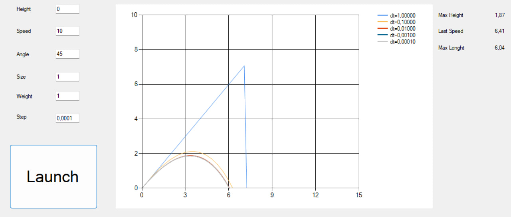

### Моделирование полёта тела в атмосфере

**Задание:**  
Реализовать приложение для моделирования полёта тела в атмосфере.  
Предусмотреть возможность ввода шага моделирования и вывода результатов.

| Шаг моделирования, с | 1 | 0.1 | 0.01 | 0.001 | 0.0001 |
|----------------------|---|-----|------|-------|--------|
| Дальность полёта, м |7,07|2,13|1,89|1,87|1,87|
| Максимальная высота, м |9,58|6,48|6,43|6,41|6,41|
| Скорость в конечной точке, м/с |7,30|6,30|6,07|6,04|6,04|

Вывод: в результате моделирования с изменением исключительно шага интегрирования выяснилось, что точность напрямую зависит от шага. Уменьшение шага снижает погрешность метода, однако и увеличивает время моделирование. Более того, выяснилось, что при переходе из 0.01 в 0.001 изменения становятся незначительными, а при дальнейшем уменьшении и вовсе не изменились, поэтому дальнейшее изменение шага не даст значительно большей точности, однако значительно увеличит время работы программы. Таким образом, оптимальный шаг для моделирования является 0.01-0.001 