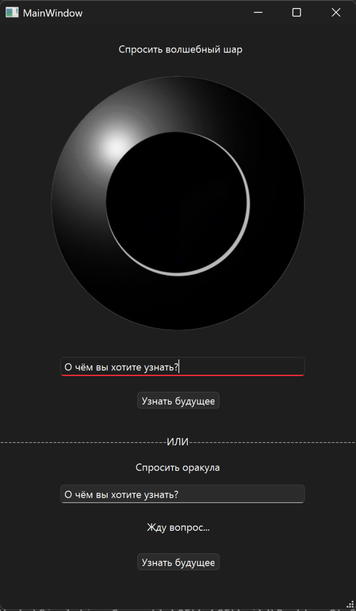

### Моделирование случайных событий (GUI)

**Часть 1:**  
Приложение «Скажи “да” или “нет”».

**Часть 2:**  
Приложение «Шар предсказаний» (Magic 8-Ball).

### Отчёт

Было реализовано приложение с одим окном для взаимодействия:

Для генерации случайных чисел был использован встроенный в с++ генератор случайных чисел mt19937 из библиотеки random.

---

В обоих приложениях вероятности событий одинаковы по значению, однако могут настраиваться. Но в программе нет никакого защитного алгоритма, который бы проверил, что сумма вероятностей равна единице. Для реализации приложения "Да/Нет" был использован примитивный алгоритм:
```cpp
if (probability >= 0.5) prediction = "Да!";
    else prediction = "Нет.";
```

---

Для реализации шара предсказаний был создан отдельный класс Prediction, экземпляры которого хранят в себе текст предсказания и вероятность его наступления. Далее представлен код инициализации данных для магического шара:
```cpp
const int predictionsAmount = 8;
    QString _predictionList[predictionsAmount] = {"Да!", "Абсолютно!", "Вероятнее всего.",
                                                  "Спросите позже:<", "Вселенная молчит.",
                                                  "В следующей жизни.", "Абсолютно нет.", "Нет."};
    double _probabilityList[predictionsAmount] = {0.125, 0.125, 0.125, 0.125, 0.125, 0.125, 0.125, 0.125};

    for (int i = 0; i < predictionsAmount; i++)
    {
        Prediction _prediction(_predictionList[i], _probabilityList[i]);
        predictionList.push_back(_prediction);
    }
```
*(predictionList является приватным полем класса MagicBall и является экземпляром класса vector)*

Для определения наступления события используется следующий алгоритм
```cpp
int i = 0;
    while (i < predictionsAmount and probability > 0)
    {
        probability -= predictionList[i].getProbability();
        i++;
    }
    prediction = predictionList[i-1].getPrediction();
```
Алгоритм вычитает вероятности каждого из событий из случайного числа probability пока probability не станет меньше или равен нулю, или пока не закончатся элементы в массиве, а затем в приватное поле класса MagicBall записывает текст сбывшегося предсказания. События сортируются по возрастанию вероятности наступления перед тем, как из них начнётся делаться выборка, чтобы наиболее вероятные события первыми проходили проверку.