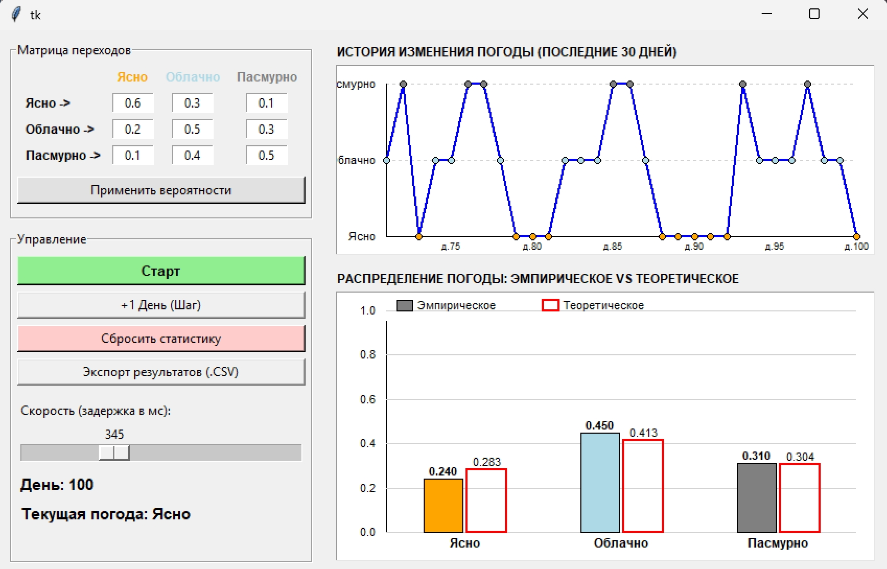

### Марковская модель погоды

**Задание:**  
Смоделировать погоду по дням:

- 1 — ясно  
- 2 — облачно  
- 3 — пасмурно  

Единица времени — **1 день**.  
Задать интенсивности переходов между состояниями.

**Требования:**
1. Выполнить моделирование в «реальном» времени с визуализацией.
2. Провести статистическую обработку результатов.
3. Сравнить эмпирическое распределение с теоретическим стационарным.
4. Сбор статистики и всей необходимой информации в .txt или .csv формат (.csv формат предпочтительней)

## 1. Описание программы
Программа представляет собой приложение с графическим интерфейсом, которое с помощью матрицы интенсивностей может моделировать погоду на основе теории цепей Маркова. Пользователь может изменять матрицу интенсивностей, скорость моделирования и экспортировать логи в .csv файл.

## 2. Результаты моделирования
Была выбрана матрица со следующими значениями

$$
\begin{pmatrix}
-0.8 & 0.6 & 0.2 \\
0.4 & -0.9 & 0.5 \\
0.1 & 0.7 & -0.8
\end{pmatrix}
$$

Для данной матрицы были получены следующие данные:

Теоретические данные: ясно - 0.25, облачно - 0.42, пасмурно - 0.32

| Объем выборки (N дней) | Эмпирическое распределение | Отклонение от теории (в среднем) |
| :---: | :---: | :---: |
| **10** | `0.08, 0.63, 0.28` | ~20% |
| **50** | `0.22, 0.29, 0.45` | ~15% |
| **100** | `0.24, 0.48, 0.42` | ~3% |
| **500** | `0.25, 0.42, 0.31` | >1% |

## 3. Вывод
В ходе лаборатной работы выяснилось, что с большим количеством выборки увеличивается так же и точность эксперимента. Наиболее вероятная погода, как теоретически, так и на практике - пасмурная, потому что сумма вероятности перехода в неё 1.2, в то время как у других - 0.9.
