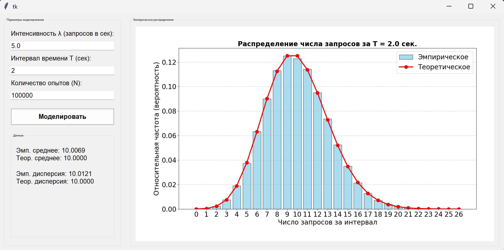

### Пуассоновский поток. События на сервере
Моделирование потока заявок на сервер.

**Задание:**
- событие — поступление заявки;
- определить число заявок за интервал времени T;
- построить распределение числа заявок;
- вычислить среднее и дисперсию;
- сделать вывод.

## 1. Описание программы
Программа представляет собой приложение с графическим интерфейсом для моделирования потока заявок на сервер через Пауссоновские потоки. Пользователь может задавать значения T и &lambda;, а так же число заявок N. Программа выводит график: синюю гистограмму, отображающую эмпирическую частоту появления заявок за единицу времени. Красным обозначена та же величина, но теоретическая. В левой нижней части программы выводятся эмпирические и теоретические дисперсия и среднее значение



## 2. Математическое обоснование
Для начала, из вводных данных генерируется величина &#956; равная произведению времени на интенсивность потока.
Случайная величина $X$ (число запросов, поступивших за время $T$) подчиняется закону распределения Пуассона с параметром $\mu$. Вероятность того, что за время $T$ придет ровно $k$ запросов, рассчитывается по формуле:

$$P(X = k) = \frac{\mu^k \cdot e^{-\mu}}{k!}$$

В которой величина k высчитывается по формуле, где Ui - случайное число, равномерно распределённое на отрезке (0;1]

$$\prod_{i=1}^{k+1} U_i < e^{-\mu}$$

Представленной в коде следующим образом:

``` python
for _ in range(n):
    k = 0
    p = 1.0
    while True:
        k += 1
        p *= random.random()
        if p < L:
            break
```

## 3. Результаты моделирования
Для опыта были взять значения интенсивности и времени равные 5 и 2 соответственно

| Объем выборки ($N$) | Эмпирическое среднее ($M$) | Эмпирическая дисперсия ($D$) |
| --- | --- | --- |
| **100** | 9.8 | 7.62 |
| **1000** | 10.018 | 10.3577 |
| **10000** | 9.9955 | 9.8643 |
| **50 000** | 10.0027 | 10.0145 |

## 4. Вывод
Повышение числа выборки уменьшается разница между эмпирическими дисперсией и средним, что подтверждает главное свойсвтво распределения Пуассона
